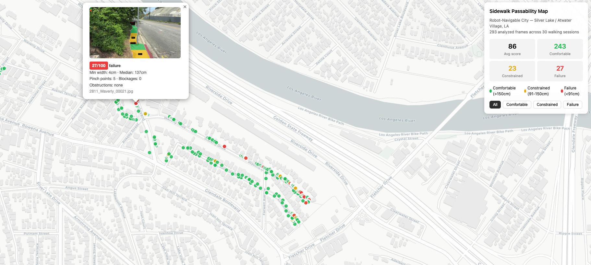

# Robot-Navigable City

**AI-powered sidewalk accessibility mapping using egocentric smartphone video**

A two-stage computer vision pipeline that (1) segments sidewalk boundaries using a pretrained foundation model, then (2) computes perspective-corrected corridor width and detects blockages using monocular depth estimation — producing geo-referenced passability maps with ADA-compliant measurements. Built at the intersection of landscape architecture, machine learning, and urban accessibility.

<<<<<<< HEAD
🗺️ **[Live Demo — Sidewalk Passability Map](https://nandiyang.github.io/robot-navigable-city/data/processed/round2_labeling/passability_map.html)** (Silver Lake, Los Angeles)
=======


🗺️ **[Live Demo — Sidewalk Passability Map](https://nandiyang.github.io/robot-navigable-city/data/processed/batch_2/passability_map.html)** (Silver Lake, Los Angeles)
>>>>>>> 2858b63 (Update README and add assets folder)

🗺️ **[Round 1 Demo — Obstacle Detection Map](https://nandiyang.github.io/robot-navigable-city/data/processed/demo_combined.html)**

📊 **[40 Comparison Pairs — Raw vs. Detection](https://drive.google.com/drive/folders/1Yoeld__oZ3oA16SBb664ld9lMIYU65P1?usp=sharing)**

🎞️ **[360-Frame Detection GIF](https://drive.google.com/drive/folders/1K7c6ybQd2IwH5GGtvu_hgndX6clv5TO0?usp=sharing)**

---

## Motivation

Despite decades of ADA standards, sidewalk accessibility barriers persist across American cities. The same infrastructure failures that exclude wheelchair users also prevent autonomous delivery robots from navigating safely. This project leverages that parallel — using smartphone-collected video and sensor data (structurally analogous to what autonomous sidewalk robots collect) as a continuous, scalable diagnostic tool for accessibility mapping.

---

## Two-Stage Pipeline

### Stage 1: Sidewalk Segmentation (pretrained, no training required)

Uses **Mask2Former** pretrained on **Mapillary Vistas** (124 semantic classes including sidewalk, curb, curb cut, utility pole, vegetation, and vehicles) to segment the scene from egocentric iPhone footage. Produces per-pixel class maps identifying walkable surface, obstructions, and street furniture.

### Stage 2a: Corridor Width & Blockage Analysis (rule-based + depth)

Uses **Depth Anything V2** (Metric Outdoor) for monocular depth estimation, then computes perspective-corrected sidewalk corridor width in centimeters at every point. Classifies the corridor as:

| Status | Criteria | Color |
|---|---|---|
| Comfortable | Width > 150cm | Green |
| Constrained | Width 91–150cm | Yellow |
| Failure | Width < 91.5cm (ADA minimum) | Red |

Detects three types of blockage:
- **Partial intrusion** — object (car, pole, vegetation) encroaching on sidewalk
- **Full blockage** — sidewalk completely eliminated by an object
- **Dead-end** — sidewalk terminates at an impassable barrier

### Stage 2b: Surface Defect Classification (planned)

Texture-based classifier for surface conditions (cracked concrete, tree root uplift, smooth pavement) within the sidewalk mask. This decomposition — geometric passability (computable) vs. surface quality (learnable) — is a core methodological contribution.

---

## Pipeline Overview

```
Field Recording (iPhone + Sensor Logger)
          ↓
extract_frames.py          — extract GPS-synced frames at 1 FPS
          ↓
merge_gps.py               — merge per-session GPS into master CSV
          ↓
sidewalk_seg.py            — Stage 1: Mask2Former segmentation
          ↓
sidewalk_width_analysis.py — Stage 2a: depth-corrected width + blockage detection
          ↓
build_passability_map.py   — generate interactive HTML passability map
```

---

## Results — Round 2 (Two-Stage Pipeline)

* **Location:** Silver Lake / Atwater Village, Los Angeles
* **Sessions:** 30 walking sessions
* **Frames:** 361 analyzed (proportionally sampled across passability classes)
* **Stage 1 Model:** Mask2Former (Swin-L backbone, Mapillary Vistas pretrained)
* **Depth Model:** Depth Anything V2 (Metric Outdoor)

Key findings:
- Foundation model segmentation (Mask2Former/Mapillary Vistas) produces accurate sidewalk boundaries from pedestrian-perspective iPhone footage without any fine-tuning
- Perspective-corrected width analysis using monocular depth estimation enables real-world measurements (cm) from single images
- Decomposing traversability into geometric passability + surface quality significantly outperforms end-to-end segmentation approaches (Round 1 baseline)

---

## Results — Round 1 (Baseline)

An initial prototype using YOLOv8 for end-to-end obstacle detection demonstrated strong detection performance but struggled with passability assessment. A subsequent attempt using YOLOv11-seg for direct traversability segmentation confirmed that a single model cannot simultaneously learn sidewalk geometry and surface quality — motivating the two-stage decomposition in Round 2.

---

## Data Collection Protocol

* **Device:** iPhone + Sensor Logger app (GPS + video synchronized)
* **Method:** Chest-height handheld, landscape orientation
* **GPS:** Sensor Logger records Location.csv with nanosecond timestamps
* **Video:** Recorded to Camera/ subfolder as .mp4
* **Study area:** Silver Lake and Atwater Village, Los Angeles

---

## Project Structure

```
robot-navigable-city/
  scripts/
    # Data preparation
    extract_frames.py              — video → GPS-synced frames
    merge_gps.py                   — combine session GPS into master CSV

    # Round 1 (baseline)
    train.py                       — YOLOv8 training
    inference.py                   — detection + GPS join
    postprocess.py                 — spatial deduplication
    build_demo.py                  — Round 1 interactive HTML demo

    # Round 2 (two-stage pipeline)
    sidewalk_seg.py                — Stage 1: Mask2Former segmentation
    sidewalk_width_analysis.py     — Stage 2a: width + blockage analysis
    build_passability_map.py       — interactive passability map

  data/
    raw/                           — field recordings (not tracked)
    processed/                     — frames, seg maps, analysis outputs (not tracked)
    datasets/                      — Roboflow exports (not tracked)
```

---

## Setup

```bash
# Clone
git clone https://github.com/nandiyang/robot-navigable-city
cd robot-navigable-city

# Create conda environment
conda create -n robot_yolo python=3.11
conda activate robot_yolo

# Install dependencies
pip install ultralytics opencv-python numpy pandas matplotlib \
            scikit-learn pyyaml tqdm pillow requests \
            torch torchvision transformers imageio scipy
```

---

## Usage — Two-Stage Pipeline

```bash
# Stage 1: Sidewalk segmentation
python scripts/sidewalk_seg.py

# Stage 2a: Width + blockage analysis
python scripts/sidewalk_width_analysis.py

# Build interactive map
python scripts/build_passability_map.py

# Open map in browser
open data/processed/round2_labeling/passability_map.html
```

---

## Roadmap

- [x] Phase 1 — Perception: YOLOv8 obstacle detection (Round 1 baseline)
- [x] Phase 2a — Foundation model segmentation + rule-based width analysis
- [ ] Phase 2b — Surface defect classification (cracked/uplifted concrete)
- [ ] Phase 3 — Route-level safe passage scoring and routing
- [ ] Integration with autonomous delivery robot navigation data
- [ ] Comparison with city ADA compliance records

---

## Research Context

This demo was developed independently as a proof-of-concept for scalable sidewalk accessibility assessment using computer vision. Beginning April 2026, the project has expanded into a research collaboration with [Prof. Bolei Zhou](https://boleizhou.github.io/) (UCLA VAIL Lab) and [Liu Liu](https://dusp.mit.edu/people/liu-liu) (MIT Urban Science). The collaboration aims to leverage advanced 2D and 3D segmentation models to assess and improve urban infrastructure at scale.

**Related work:**

* [MetaUrban: A Simulation Platform for Embodied AI in Urban Spaces](https://metadriverse.github.io/metaurban/)
* [Urban Robotics Foundation](https://www.urbanroboticsfoundation.org/post/public-area-mobile-robots-through-a-planner-s-lens)
* [Streets for All](https://www.streetsforall.org/)
* [LA City Controller — Sidewalk Audit](https://controller.lacity.gov/audits/sidewalks)

---

## Author

**Nandi Yang**
Landscape Architecture + Machine Learning
Georgia Institute of Technology

---

## License

Data and trained models: [CC BY 4.0](https://creativecommons.org/licenses/by/4.0/)
Code: [MIT License](LICENSE)
